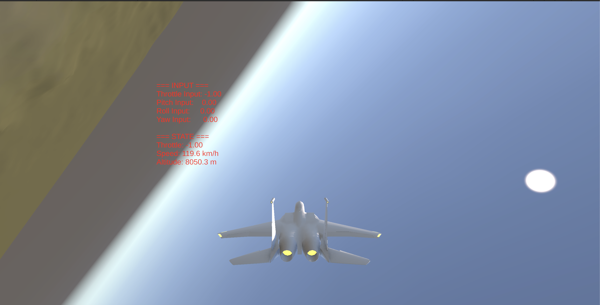
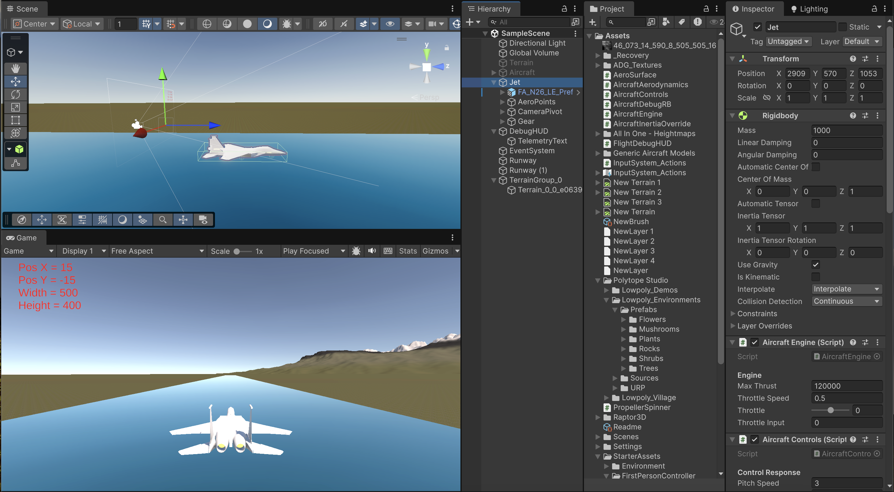

# Flight Simulator

A Unity-based flight simulator focused on **physics-based aircraft movement and control** rather than visual fidelity.

The project simulates core aircraft controls and state in real time, including throttle, pitch, roll, yaw, speed, and altitude, inside a 3D mountainous environment.

## Example



### Unity Editor



## Project Goal

The goal of this project is to explore how aircraft behavior can be approximated inside a real-time game engine.

Rather than moving the aircraft using simple scripted translations, the simulator uses Unity's physics system together with custom aircraft-control and simulation logic.

The project is intended as an educational and experimental flight simulator rather than a commercial-grade aviation simulator.

## Features

- Real-time aircraft simulation
- Throttle control
- Pitch, roll, and yaw controls
- Aircraft speed and altitude tracking
- Physics-based movement using Unity
- Third-person chase camera
- Real-time debug information
- 3D terrain and environment
- Aircraft model with animated flight behavior

## Controls

The simulator supports the main aircraft control axes:

| Control  | Description                                   |
| -------- | --------------------------------------------- |
| Throttle | Controls engine thrust                        |
| Pitch    | Rotates the aircraft nose up or down          |
| Roll     | Banks the aircraft left or right              |
| Yaw      | Rotates the aircraft around its vertical axis |

The exact keyboard or controller bindings can be viewed and changed through the Unity input configuration included with the project.

## Physics Simulation

The simulator attempts to reproduce the main behavior expected from an aircraft rather than using purely arcade-style movement.

Player input controls:

- throttle
- pitch
- roll
- yaw

The aircraft state is continuously updated through Unity's physics system.

The project includes separate components for aircraft aerodynamics, engine behavior, controls, inertia handling, aerodynamic surfaces, and real-time flight debugging.

The on-screen debug display provides immediate feedback about control inputs and aircraft state, including speed and altitude.

## Requirements

To open and run the project:

- Unity Hub
- The Unity Editor version specified by the project
- Git LFS if required by the large project assets

The exact Unity version is stored in:

```text
ProjectSettings/ProjectVersion.txt
```

Unity Hub should normally detect the required editor version automatically.

## Cloning the Repository

Clone the repository:

```bash
git clone https://github.com/jusosojnik/Flight-Simulator.git
cd Flight-Simulator
```

If the repository uses Git LFS, install it and download the managed assets:

```bash
git lfs install
git lfs pull
```

## Opening the Project

1. Open **Unity Hub**.
2. Click **Add** or **Open**.
3. Select the cloned `Flight-Simulator` folder.
4. Open the project using the Unity version listed in `ProjectSettings/ProjectVersion.txt`.
5. Wait for Unity to import the project assets.
6. Open the main flight scene from the `Assets` folder.
7. Press **Play** in the Unity Editor.

The first launch may take longer because Unity needs to rebuild its local `Library` folder.

## Project Structure

The main Unity project folders are:

```text
Flight-Simulator/
├── Assets/
├── Packages/
├── ProjectSettings/
├── .gitignore
├── .gitattributes
├── game_example.png
└── unity_editor_example.png
```

### `Assets/`

Contains the project source content, including:

- C# simulation scripts
- scenes
- aircraft models
- terrain data
- materials and textures
- UI elements
- Unity assets

Important custom scripts include:

```text
AeroSurface.cs
AircraftAerodynamics.cs
AircraftControls.cs
AircraftEngine.cs
AircraftInertiaOverride.cs
AircraftDebugRB.cs
FlightDebugHUD.cs
PropellerSpinner.cs
TerrainAutoTextureByHeight.cs
```

### `Packages/`

Contains the Unity package configuration required by the project.

### `ProjectSettings/`

Contains project-wide Unity settings such as the editor version, physics settings, rendering configuration, and input settings.

## Files Not Stored in Git

Unity generates several local directories that should not be committed:

```text
Library/
Temp/
Logs/
Obj/
Build/
Builds/
UserSettings/
```

These folders are regenerated automatically by Unity and are excluded through `.gitignore`.

## Possible Future Improvements

Possible extensions include:

- More detailed aerodynamic modeling
- Lift and drag curves based on angle of attack
- Stall behavior
- Wind and turbulence
- Landing gear and ground handling
- Cockpit camera
- Multiple aircraft
- Improved instrumentation
- Controller / joystick support
- Weather effects
- Missions and checkpoints
- Larger environments
- Improved terrain optimization

## Notes

This project was created as an experimental Unity flight simulator and as an exploration of aircraft physics, real-time simulation, and 3D game development.

It is not intended to reproduce the accuracy of a professional certified flight simulator, but rather to provide a more physically motivated flight model than simple arcade-style aircraft movement.
